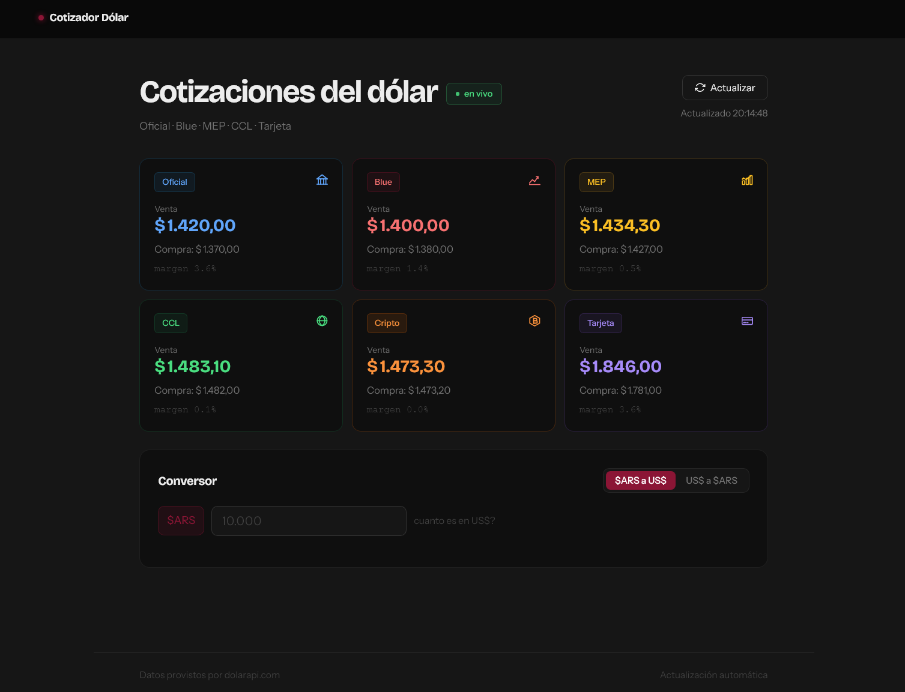

# 🏦 Cotizador de Dólar en Tiempo Real

Este proyecto es un dashboard financiero interactivo que permite visualizar las distintas cotizaciones del dólar en Argentina (Oficial, Blue, MEP, CCL, Cripto y Tarjeta) consumiendo datos en tiempo real. 

Incluye un conversor inteligente diseñado para resolver casos de uso comunes, como el cálculo de gastos en plataformas del exterior (Steam, Netflix, etc.).

## 🚀 Características Principales

- **Datos en tiempo real:** Consumo de la API pública de `dolarapi.com`.
- **Conversor bidireccional:** Permite convertir de Pesos a Dólares y viceversa para todos los tipos de cambio.
- **Lógica de conversión avanzada:** El sistema diferencia automáticamente cuándo usar el precio de compra o venta (ej: usa precio de venta para "Dólar Tarjeta" incluso en conversión a Pesos para simular costos de compra reales).
- **Interfaz moderna y responsive:** Diseño *dark mode* optimizado para dispositivos móviles y escritorio.
- **Experiencia de usuario (UX):** Implementación de *skeleton loaders* durante la carga inicial y animaciones suaves.
- **Robustez técnica:** Manejo de errores asincrónicos, control de *timeouts* en peticiones de red y actualizaciones automáticas cada 60 segundos.

## 🛠️ Tecnologías Utilizadas

- **HTML5:** Marcado semántico.
- **CSS3:** Uso de variables (*Custom Properties*), Flexbox, CSS Grid y animaciones personalizadas.
- **JavaScript (ES6+):** - Manipulación dinámica del DOM.
  - Consumo de APIs REST mediante `fetch` y `async/await`.
  - Manejo de asincronía y control de errores (`try/catch`, `AbortSignal`).
  - Formateo internacional de moneda (`toLocaleString`).

## 🧠 Desafíos Técnicos Resueltos

### Lógica del Conversor (El "Caso Steam")
Uno de los mayores desafíos fue adaptar el conversor a la realidad del mercado argentino. Mientras que para la mayoría de los dólares se utiliza el precio de **compra** al convertir de USD a ARS (cuántos pesos recibís por tus dólares), para el **Dólar Tarjeta** el sistema utiliza el precio de **venta**, ya que refleja el costo real de una compra en el exterior (ej. un juego en Steam).

### Consumo de API Seguro
Se implementó un sistema de "escudo protector" que incluye:
- **Timeouts:** Si la API no responde en 6 segundos, el sistema aborta la petición para evitar esperas infinitas.
- **Fallbacks:** En caso de error de conexión, el sistema está preparado para notificar al usuario mediante una barra de error visual.